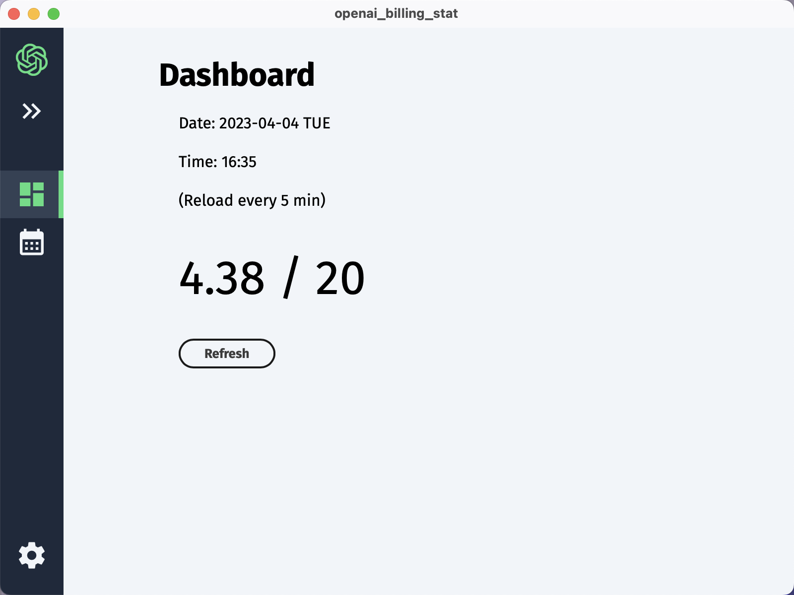
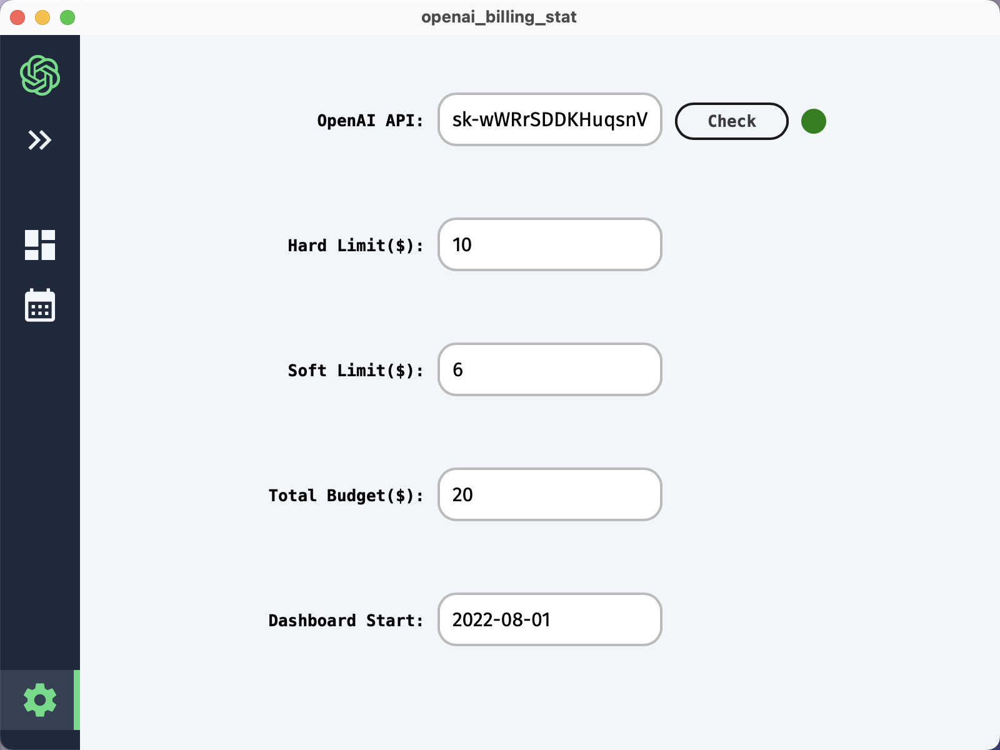

# OpenAI Billing Stat

This project is designed to help users calculate the total cost of using OpenAI API services. The tool is specifically developed to provide an easy and straightforward way for businesses and individuals to get billing statistics and pricing insights.





# Install

```bash
npm run tauri build
```

